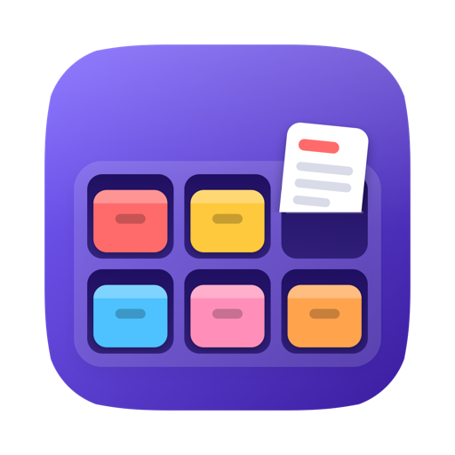
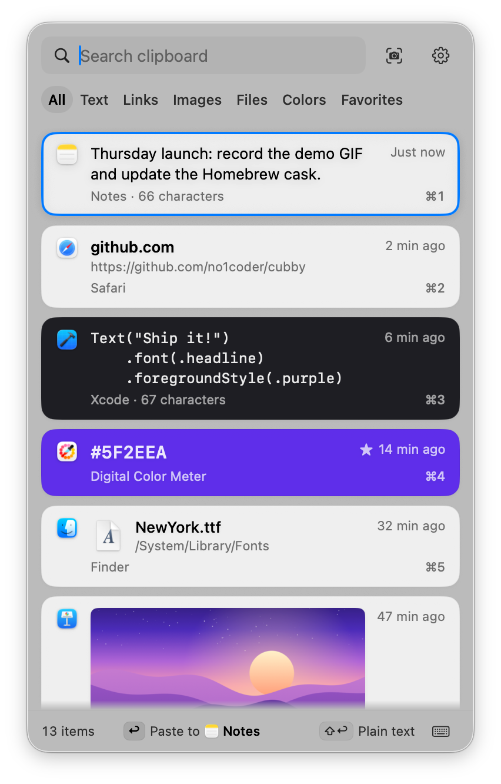
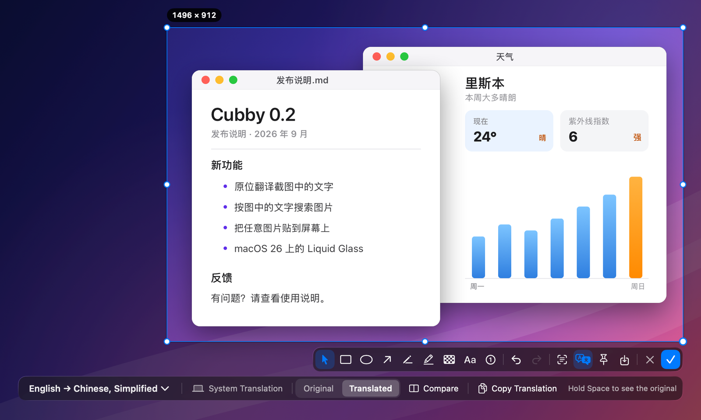
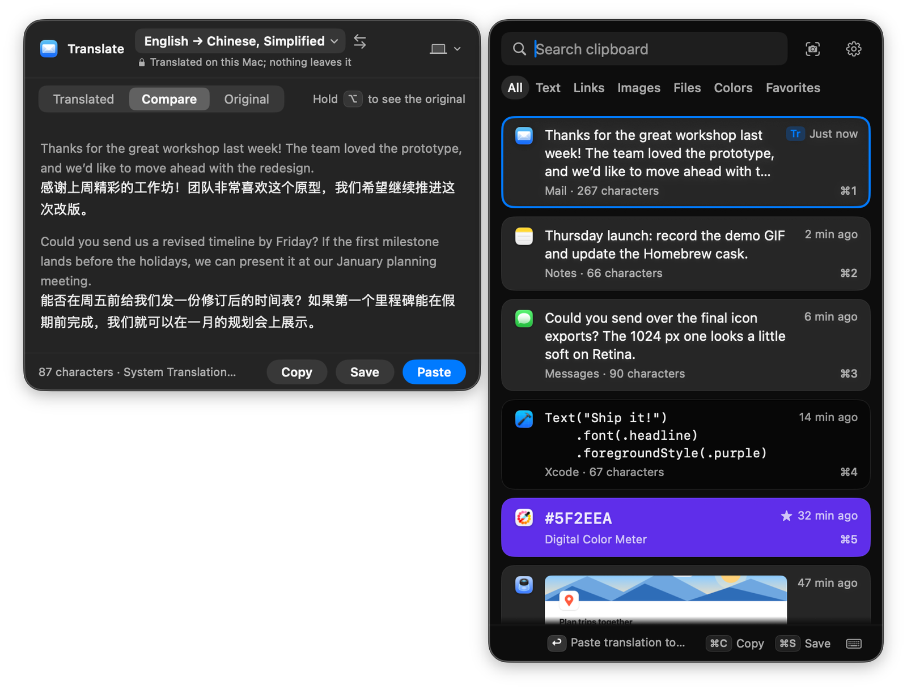
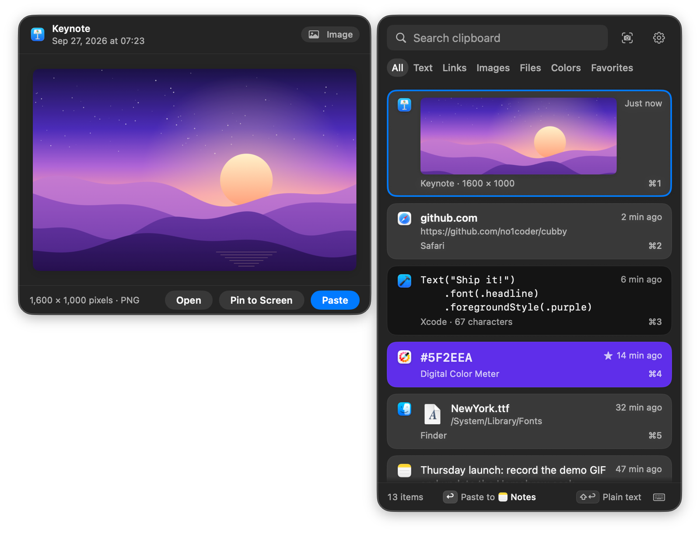
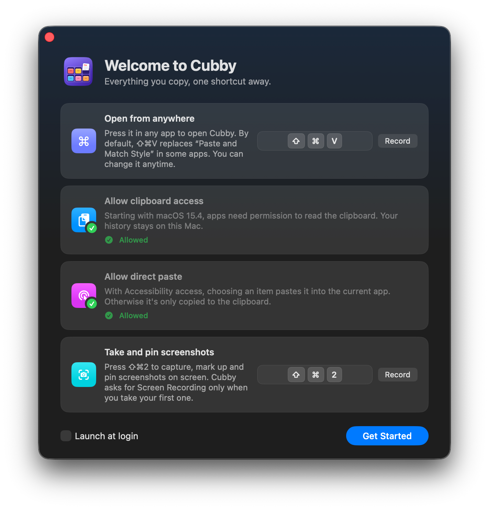
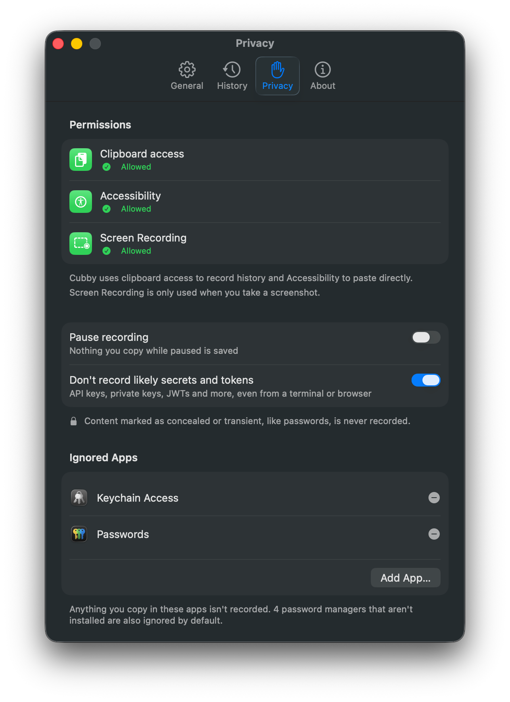
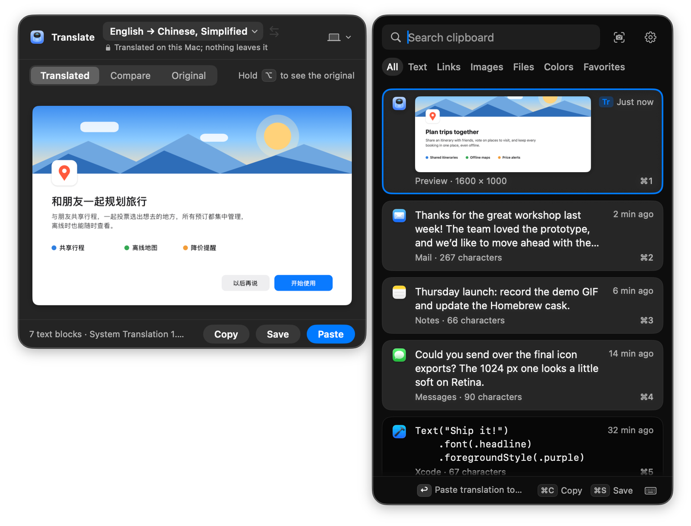
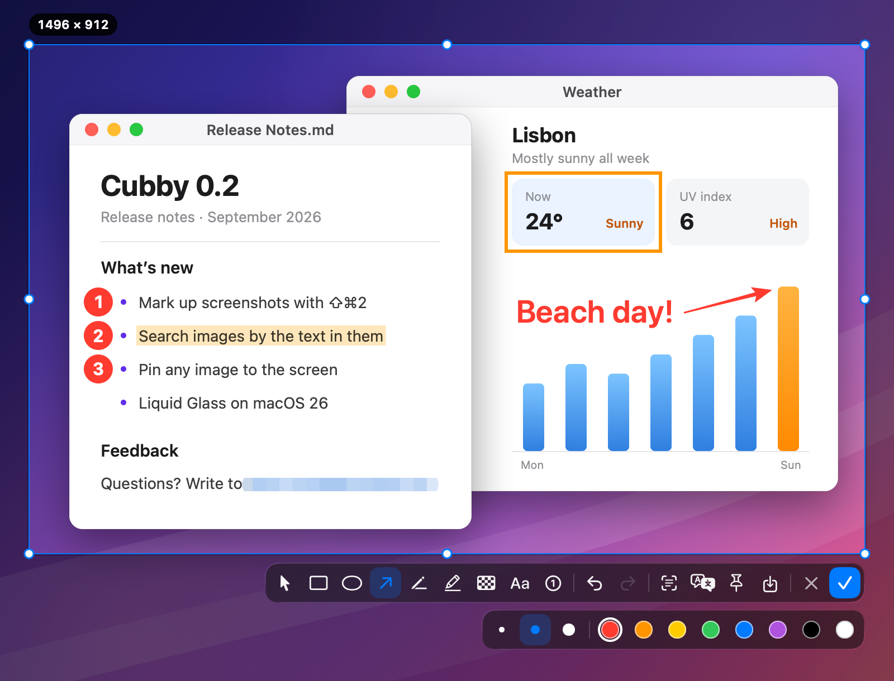
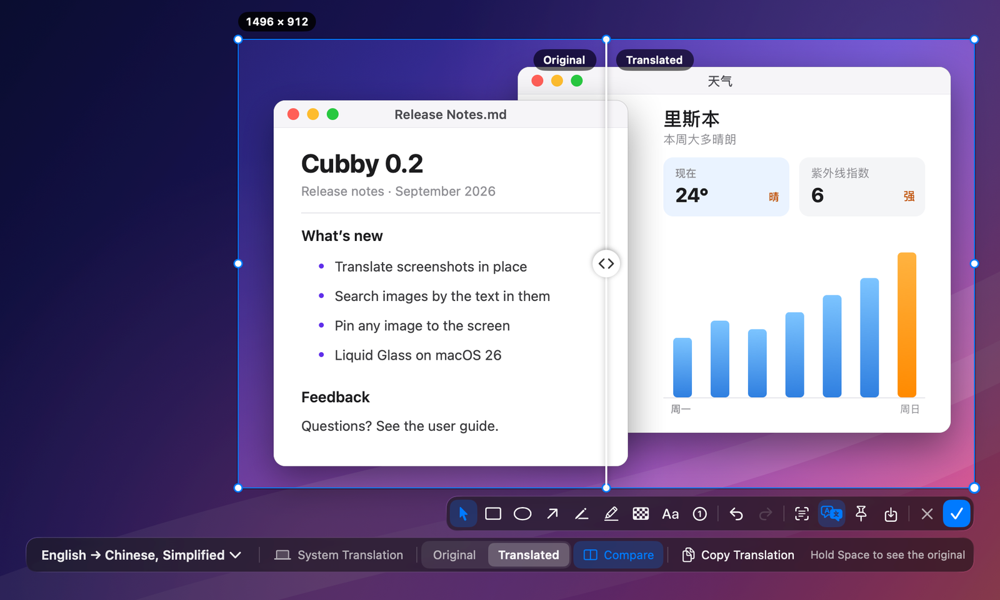

<p align="center">
  
</p>

<h1 align="center">Cubby</h1>

<p align="center">
  A native, keyboard-first clipboard history for macOS that keeps everything on your Mac.
</p>

<p align="center">
  <a href="LICENSE"></a>
  
  
</p>

<p align="center">
  <b>English</b> · <a href="README.zh-Hans.md">简体中文</a>
</p>

```sh
brew install --cask no1coder/tap/cubby
```

Or download the notarized DMG from [Releases](https://github.com/no1coder/cubby/releases/latest). Requires macOS 14 or later, Apple silicon or Intel.

<p align="center">
  <picture>
    <source media="(prefers-color-scheme: dark)" srcset="docs/assets/screenshots/panel-dark.png">
    <source media="(prefers-color-scheme: light)" srcset="docs/assets/screenshots/panel-light.png">
    
  </picture>
</p>

Cubby sits in your menu bar and remembers what you copy: text, links, colors, images and files. Press <kbd>⇧⌘V</kbd>, type a few letters to find what you need, and press <kbd>↩</kbd> to paste it into the app you were using. Press <kbd>⇧⌘2</kbd> to take a screenshot, mark it up, and it lands in your history next to everything else you copied. It only goes online to check for a new version (once a day, and you can turn that off) or to translate with a language model you set up yourself.

## Features

**Capture**

- Records text, links, HEX colors, images and files. Rich text keeps its RTF / HTML formatting.
- Copying something again moves it back to the top instead of creating a duplicate.
- Favorites never expire; everything else is trimmed to a history limit you choose (50 – 2,000 items, 500 by default).

**Find**

- A global shortcut (<kbd>⇧⌘V</kbd> by default, or record your own) opens a card panel, with Liquid Glass on macOS 26.
- Cards look like their content: a color card shows the color, code is monospaced, images show a thumbnail.
- Just start typing to search. Matches are highlighted, every word must match, and file paths and source app names are searchable too. The best matches come first, starting with items that contain your exact phrase.
- Find images, screenshots included, by the text in them. The text is recognized on your Mac and never uploaded, and you can turn this off in Settings › History.
- Filter by Text, Links, Images, Files, Colors or Favorites with <kbd>⇥</kbd>.
- <kbd>Space</kbd> or <kbd>⌘Y</kbd> opens a side preview with the full content.
- The panel opens next to the pointer, under the menu bar icon, or in the center of the screen.

**Paste**

- <kbd>↩</kbd> pastes into the app you were using; the footer shows which app that is.
- <kbd>⇧↩</kbd> pastes in the other format (original ↔ plain text), <kbd>⌘↩</kbd> only copies.
- <kbd>⌘1</kbd> – <kbd>⌘9</kbd> paste one of the first nine items; any card can be dragged into another app.
- <kbd>⌘⌫</kbd> deletes an item, <kbd>⌘Z</kbd> brings it back.
- On macOS 26, <kbd>⌘T</kbd> translates the selected item in a card beside the panel, and <kbd>⌥↩</kbd> translates and pastes it in one step. See [Clipboard translation](#clipboard-translation).

**Screenshots**

- <kbd>⇧⌘2</kbd> freezes the screen so you can pick a window or drag out an area. Finished screenshots are copied to the clipboard **and saved to your clipboard history**, so you can find them and paste them again later, like anything else you copy.
- Windows are detected as you hover. Where windows overlap, <kbd>⇥</kbd> or the scroll wheel steps through them one layer at a time, so even a mostly hidden window is one click away. Press <kbd>Space</kbd> for a clean capture of just that window, unobstructed, with its rounded corners and shadow.
- Annotate with rectangles, ellipses, arrows, a pen, a highlighter, mosaic, text and numbered steps. Annotations stay editable until you finish: select one to move it, change its color or delete it.
- Pin a screenshot to the screen as a floating window, save it as a PNG, or extract its text with on-device Vision OCR. Nothing goes online.
- Pin any image from your history to the screen the same way with <kbd>⇧⌘P</kbd>.
- On macOS 26, translate the text in a screenshot in place with <kbd>⇧⌘T</kbd>, using Apple's on-device translation (the default) or an OpenAI-compatible model such as DeepSeek, Qwen, Kimi or a local Ollama. See [Screenshot translation](#screenshot-translation).
- A pixel magnifier shows the color under the pointer; press <kbd>C</kbd> to copy it.

**Private by design**

- History is stored only on your Mac and is excluded from Time Machine.
- Skips content that password managers mark as concealed or transient, apps in your **Ignored Apps** list, and, by default, text that looks like an API key, private key or JWT.
- Pause recording at any time from the menu bar; the panel shows a banner until you resume.
- No network access except a daily update check, which only reads the latest version number from GitHub (ticked by default on the welcome screen, and you can turn it off), and translating with a model you set up. No analytics, no telemetry. See [Privacy](#privacy).

**Native**

- Swift 6 with SwiftUI and AppKit, zero third-party dependencies, Universal binary.
- Menu bar only, no Dock icon. English and Simplified Chinese interface; it follows macOS by default, or pick one in Settings › General.
- Works with VoiceOver, and follows Reduce Motion and Increase Contrast.

| Translate a screenshot in place | Translate a clipboard item |
| :---: | :---: |
|  |  |

<details>
<summary><b>More screenshots</b></summary>
<br>

| Side preview | First launch | Privacy settings |
| :---: | :---: | :---: |
|  |  |  |

</details>

## Install

### Homebrew (recommended)

```sh
brew install --cask no1coder/tap/cubby
```

Update with `brew upgrade --cask cubby`.

### Download

1. Download `Cubby-x.y.z.dmg` from the [latest release](https://github.com/no1coder/cubby/releases/latest).
2. Open it and drag **Cubby** into **Applications**.
3. Launch Cubby from Applications (not from the disk image or your Downloads folder).

Releases are signed with a Developer ID and notarized by Apple, so macOS asks for confirmation only once. Each release also includes a `.zip` and `SHA256SUMS.txt`.

### Build from source

```sh
git clone https://github.com/no1coder/cubby.git
cd cubby
make install    # builds a Universal release app, copies it to /Applications and launches it
```

Requires Xcode 26. See [CONTRIBUTING.md](CONTRIBUTING.md) for signing options: with the default ad-hoc signature, macOS forgets the Accessibility and Screen Recording permissions after every rebuild.

## User guide

The [user guide](docs/USER-GUIDE.md) walks through every feature step by step. In the app, choose **User Guide…** from the menu bar icon's menu (it's also in Settings › About and at the bottom of the panel's shortcut help).

## First launch and permissions

On first launch Cubby opens a short guide where you set the panel shortcut, allow two permissions (their status updates live) and see how screenshots work. You can reopen it any time with **Setup Guide…** in the menu bar icon's right-click menu. A third permission, Screen Recording, is only needed for screenshots, so the guide doesn't ask for it: Cubby asks the first time you take a screenshot.

**Clipboard access on macOS 15.4 and later.** Click **Grant Access** in the guide (or in Settings › Privacy) and macOS asks right away; choose **Allow Paste**. If nothing happens, copy something first and click again. The prompt has no "always allow" choice, so macOS would keep asking every time you copy: set Cubby to **Allow** in System Settings › Privacy & Security › Paste from Other Apps (called Paste before macOS 26). Once macOS has asked, the button changes to **Open System Settings** and takes you there.

| Permission | Why Cubby needs it | Where to grant it |
| --- | --- | --- |
| **Clipboard access** (macOS 15.4 and later) | To read what you copy. Without it macOS keeps asking, or nothing gets recorded. | Click **Grant Access** and choose **Allow Paste**, then System Settings › Privacy & Security › Paste from Other Apps (Paste before macOS 26) → set Cubby to **Allow** |
| **Accessibility** | To paste directly by sending <kbd>⌘V</kbd> to the frontmost app. Without it, choosing an item only copies it to the clipboard. | System Settings › Privacy & Security › Accessibility → turn on **Cubby** |
| **Screen Recording** (only for screenshots) | To capture the screen when you take a screenshot. It's never used at launch or in the background, and clipboard history works without it. | System Settings › Privacy & Security › Screen & System Audio Recording (Screen Recording on macOS 14) → turn on **Cubby** |

After you turn on Screen Recording, macOS may ask you to quit and reopen Cubby before screenshots work; the **Quit & Reopen Cubby** button in Cubby's Screen Recording window does both. Settings › Privacy shows the status of all three permissions.

Click the menu bar icon to open the panel; right-click (or Control-click) it for screenshots, pause, clear history, settings and quit.

## Keyboard shortcuts

| Key | Action |
| --- | --- |
| <kbd>⇧⌘V</kbd> | Open or close the panel (global, customizable in Settings › General) |
| Type anything | Search |
| <kbd>↑</kbd> <kbd>↓</kbd> or <kbd>⌃P</kbd> <kbd>⌃N</kbd> | Move the selection |
| <kbd>⌥↑</kbd> <kbd>⌥↓</kbd> or <kbd>Home</kbd> <kbd>End</kbd> | Jump to the first / last item |
| <kbd>Page Up</kbd> <kbd>Page Down</kbd> | Move up / down 5 items |
| <kbd>↩</kbd> or double-click | Paste into the current app |
| <kbd>⇧↩</kbd> | Paste in the other format (original ↔ plain text) |
| <kbd>⌘↩</kbd> | Copy only, don't paste |
| <kbd>⌘1</kbd> – <kbd>⌘9</kbd> | Paste item 1 – 9 |
| <kbd>⌘T</kbd> | Translate the selected item (macOS 26); press again to close the translation card |
| <kbd>⌥↩</kbd> | Translate and paste (macOS 26) |
| <kbd>Space</kbd> / <kbd>⌘Y</kbd> | Toggle the preview (<kbd>Space</kbd> only while the search field is empty) |
| <kbd>⇥</kbd> / <kbd>⇧⇥</kbd> | Next / previous category |
| <kbd>⌘P</kbd> | Favorite / unfavorite |
| <kbd>⇧⌘P</kbd> | Pin the selected image to the screen |
| <kbd>⌘⌫</kbd> | Delete |
| <kbd>⌘Z</kbd> | Undo delete |
| <kbd>⌘O</kbd> | Open the link or file |
| <kbd>⌘,</kbd> | Settings |
| <kbd>esc</kbd> | Close help or preview → clear search → close the panel |

The keyboard button at the right of the panel footer shows this list inside the app, and right-clicking a card lists its actions with their shortcuts.

## Clipboard translation

On macOS 26, select an item in the panel and press <kbd>⌘T</kbd> (or <kbd>⇧⌘T</kbd>). A translation card opens beside the panel and fills in paragraph by paragraph. Rich text keeps its headings, lists, bold text and links, and inline code isn't translated. Images are translated in place, like screenshots. While the card is open, it follows your selection. In the card, <kbd>↩</kbd> pastes the translation, <kbd>⇧↩</kbd> pastes it as plain text, <kbd>⌘C</kbd> copies it and <kbd>⌘S</kbd> saves it as a new item. Copying or pasting a translation doesn't add it to your history.

<p align="center">
  
</p>

- <kbd>⌥↩</kbd> translates the selected item and pastes the translation in one step.
- Hold <kbd>⌥</kbd> on an item to preview its translation in the list, and release it to go back. Pressing <kbd>↩</kbd> while you hold it pastes what you see.
- The card's language menu can remember a target language for the app you're pasting into, for example always English when pasting into Slack. Settings › Translation lists these apps.
- Translations are saved with the item, so they show up instantly the next time, and search finds items by their translations too. **Settings › Translation › Clear All Translations…** deletes them.
- **Translate text when you copy it** (Settings › Translation, off by default) translates foreign text as you copy it, with System Translation on your Mac. It only works for languages you've already downloaded, and it never downloads a language or goes online.

Clipboard translation uses the engine you chose for screenshots (see [Screenshot translation](#screenshot-translation)). With a large language model, only the text of the item you translate is sent (for an image, the text recognized in it). Text that looks like a secret is sent only after you confirm it, and never from an image.

## Screenshots

Press <kbd>⇧⌘2</kbd>, choose **Take Screenshot** from the menu bar icon's right-click menu, or click the camera button in the panel. The screen freezes and the window under the pointer lights up: click to select it, or drag to select an area. Fine-tune the selection with its handles, draw on it with the toolbar, then press <kbd>↩</kbd>. The screenshot is copied to the clipboard and saved to your history, and the app you were using stays in front, so you can paste it right away.

<p align="center">
  
</p>

| Key | Action |
| --- | --- |
| <kbd>⇧⌘2</kbd> | Take a screenshot (global, customizable in Settings › Screenshots) |
| Click / drag | Select the highlighted window or screen / select an area |
| <kbd>⇥</kbd> / <kbd>⇧⇥</kbd> or scroll | Step through overlapping windows under the pointer, down to the whole screen |
| <kbd>Space</kbd> | Window mode: a click or <kbd>↩</kbd> then captures only the highlighted window, unobstructed, with its shadow (<kbd>⌥</kbd>-click leaves out the shadow). Press <kbd>Space</kbd> again to leave |
| Hold <kbd>⇧</kbd> / <kbd>⌥</kbd> / <kbd>Space</kbd> while dragging | Square selection / grow from the center / move the selection |
| <kbd>⌘A</kbd> | Select the whole screen |
| <kbd>↑</kbd> <kbd>↓</kbd> <kbd>←</kbd> <kbd>→</kbd> | Move the selection, or the selected annotation, by 1 pt (10 pt with <kbd>⇧</kbd>) |
| <kbd>R</kbd> <kbd>O</kbd> <kbd>A</kbd> <kbd>P</kbd> <kbd>H</kbd> <kbd>M</kbd> <kbd>T</kbd> <kbd>N</kbd> | Rectangle, ellipse, arrow, pen, highlighter, mosaic, text, number. Press the same key again, or <kbd>V</kbd>, to go back to the pointer |
| <kbd>⌫</kbd> | Delete the selected annotation |
| <kbd>⌘Z</kbd> / <kbd>⇧⌘Z</kbd> | Undo / redo annotations |
| <kbd>C</kbd> | Copy the color under the magnifier (hold <kbd>⇧</kbd> to show RGB instead of HEX) |
| <kbd>↩</kbd>, <kbd>⌘C</kbd> or double-click | Done: copy to the clipboard and history |
| <kbd>⌘S</kbd> | Save as a PNG: a save dialog lets you pick the folder and file name. Cancel it to go back to your screenshot with its annotations |
| <kbd>⌘P</kbd> | Pin to the screen |
| <kbd>⌘T</kbd> | Extract text and copy it |
| <kbd>⇧⌘T</kbd> | Translate the text in the selection (macOS 26). Once translated, switch between the original and the translation |
| Right-click | Clear the selection and select again (annotations stay); with no selection, cancel |
| <kbd>esc</kbd> | Cancel. Once you've drawn something, press <kbd>esc</kbd> twice to discard it |

While you type in a text box, <kbd>esc</kbd> or <kbd>⌘↩</kbd> finishes the text instead of canceling, so input methods keep working.

A pinned screenshot floats above your windows. Drag it to move it, scroll or pinch to zoom, press <kbd>⌘0</kbd> for actual size, and right-click it to copy, save or change its opacity. Double-click it or press <kbd>esc</kbd> to close it. Images already in your history can be pinned too: select one in the panel and press <kbd>⇧⌘P</kbd>, or choose **Pin to Screen** from its right-click menu or the preview, and it appears in the middle of the screen.

In Settings › Screenshots you can change or turn off the shortcut and choose the save folder; by default it's the same folder as macOS screenshots. The save dialog starts in the folder you used last. Turn off **Ask where to save each time** to have <kbd>⌘S</kbd> save straight to that folder without a dialog. While recording is paused, screenshots still work but aren't added to your history. The first screenshot asks for the Screen Recording permission (see [First launch and permissions](#first-launch-and-permissions)).

### Screenshot translation

On macOS 26, click **Translate** in the screenshot toolbar or press <kbd>⇧⌘T</kbd>. Cubby recognizes the text in the selection, translates it block by block and draws each translation where the original was. Hold <kbd>Space</kbd> to peek at the original, or use the slider to compare. Copying and saving use whichever version the Original / Translation switch shows.

<p align="center">
  
</p>

Choose the engine in **Settings › Translation**:

- **System Translation** (default): Apple's built-in Translation. It runs on your Mac and works offline. The first time you translate a language, macOS asks to download its language pack; Cubby shows that prompt, and you decide.
- **Large language model**: any service with an OpenAI-compatible Chat Completions API. Presets: DeepSeek, Qwen (Alibaba Cloud Model Studio, China and international endpoints), Kimi (Moonshot AI), Zhipu GLM (and Z.ai), OpenAI, OpenRouter, Ollama on your Mac, or a custom base URL. Pick a model from the list (**Refresh**) or type its name, then click **Test Connection**. These settings appear once you choose **Large Language Model** as the engine; from then on translations use the model, and you can switch back to system translation at any time.

Your API key is stored in the macOS login Keychain, one entry per provider. It never goes into preferences, history or logs, and Settings only shows its last four characters. When you translate with a model, only the text recognized in the selection is sent, to the service you chose. The image is never uploaded, and text under mosaic or text that looks like a secret is never sent. Remote services must use HTTPS; plain HTTP is only allowed for `localhost`.

## Privacy

- **Local only.** History lives in `~/Library/Application Support/Cubby`: the folder is readable only by you (0700), files are 0600, and the folder is excluded from Time Machine.
- **Skips sensitive content.** Items marked concealed or transient (as password managers do), apps in your Ignored Apps list (Settings › Privacy), and, unless you turn it off, text that looks like an API key, private key or JWT.
- **Pastes where you expect.** Cubby checks that the target app is still frontmost before sending <kbd>⌘V</kbd>.
- **Screenshots stay on your Mac.** The screen is captured only when you take a screenshot. While you select and annotate, the image stays in memory, and canceling leaves nothing behind. Text is recognized on your Mac with Apple's Vision framework.
- **Image text stays local.** To make images searchable, text in them is recognized on your Mac and kept only in your history file. Turning off Settings › History › Search text in images deletes it.
- **Online only for updates and the translation service you set up.** The automatic update check (once a day, ticked by default on the welcome screen, and you can turn it off in Settings › General) and **Check for Updates** only read the latest version number from `api.github.com/repos/no1coder/cubby/releases/latest` and upload nothing. Screenshot translation with a large language model sends the text recognized in the selection, and nothing else, to the service you set up; translating a clipboard item with it sends that item's text. System Translation, and translating when you copy, stay on your Mac.
- **No analytics, no telemetry, no crash reporting.**

Full details in [PRIVACY.md](PRIVACY.md).

## FAQ

<details>
<summary><b>Accessibility is switched on, but Cubby only copies instead of pasting.</b></summary>

macOS ties the permission to the app's code signature. After an update, or after installing a build signed differently (for example a source build and then a release), the switch can still look on while no longer applying. Open System Settings › Privacy & Security › Accessibility, select **Cubby**, click **−** to remove it, then add it again or relaunch Cubby and grant access. Alternatively, run:

```sh
tccutil reset Accessibility io.github.no1coder.Cubby
```

Then open Cubby and grant access again.

</details>

<details>
<summary><b>macOS says Cubby can't be opened or can't be verified.</b></summary>

Official releases are notarized, so you should see a single "downloaded from the Internet" confirmation and nothing else. Make sure you downloaded Cubby from this repository's Releases page or installed it with Homebrew, and that you launch it from Applications. You can check the signature with:

```sh
spctl -a -vvv /Applications/Cubby.app    # expect: source=Notarized Developer ID
```

If the check fails, delete the app, download it again and [open an issue](https://github.com/no1coder/cubby/issues/new/choose) if the problem persists. There is no need to disable Gatekeeper.

</details>

<details>
<summary><b>Where is my data stored?</b></summary>

- History: `~/Library/Application Support/Cubby` (`history.json` plus an `Images` folder)
- Preferences: `~/Library/Preferences/io.github.no1coder.Cubby.plist`
- Saved screenshots: wherever you choose in the save dialog, or, with **Ask where to save each time** turned off, the folder in Settings › Screenshots (by default, the same folder as macOS screenshots)

Settings › History can reveal the folder in Finder. See [PRIVACY.md](PRIVACY.md) for exactly what is stored.

</details>

<details>
<summary><b>Can I export or back up my history?</b></summary>

Not yet. Import and export are planned for v0.3 (see the [roadmap](docs/ROADMAP.md)). The data folder is excluded from Time Machine on purpose, because clipboards often contain sensitive content. Until export ships, you can quit Cubby and copy `~/Library/Application Support/Cubby` manually. Keep in mind that the copy contains everything you have copied, unencrypted.

</details>

<details>
<summary><b>How do I uninstall Cubby?</b></summary>

With Homebrew, this removes the app and all of its data:

```sh
brew uninstall --zap --cask cubby
```

Otherwise, quit Cubby and run:

```sh
rm -rf /Applications/Cubby.app ~/Library/Application\ Support/Cubby
defaults delete io.github.no1coder.Cubby
tccutil reset All io.github.no1coder.Cubby
```

</details>

## Contributing

Bug reports, translations and pull requests are welcome. [CONTRIBUTING.md](CONTRIBUTING.md) covers building from source, tests, code style and local signing. Please read the [Code of Conduct](CODE_OF_CONDUCT.md), and report security issues privately as described in [SECURITY.md](SECURITY.md).

## Roadmap

See [docs/ROADMAP.md](docs/ROADMAP.md). Planned for v0.3: automatic cleanup by age, multi-select and merged paste, a paste queue, text transforms, editing before pasting, Quick Look and import / export. Later screenshot improvements include selecting UI elements by holding <kbd>⌥</kbd> and restoring the last selection. Release notes are in [CHANGELOG.md](CHANGELOG.md).

## License

[MIT](LICENSE) © 2026 no1coder
