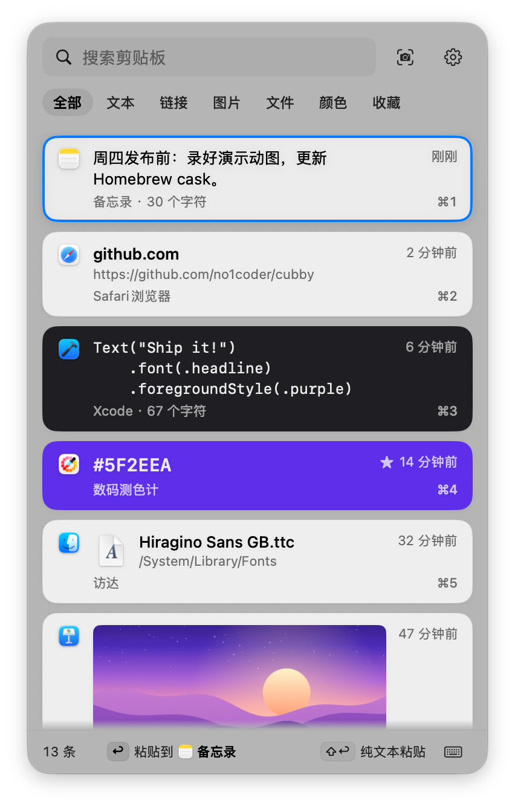
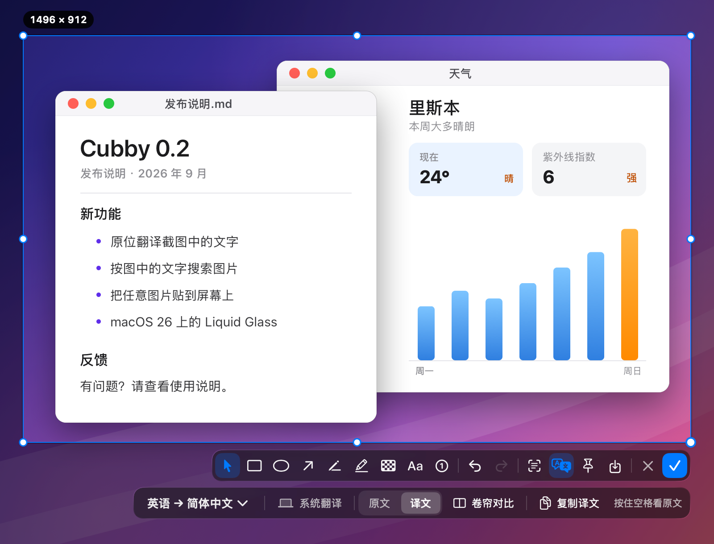
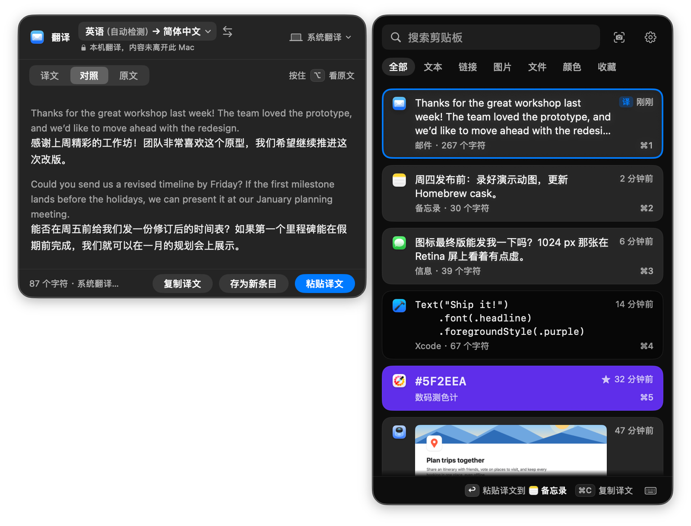
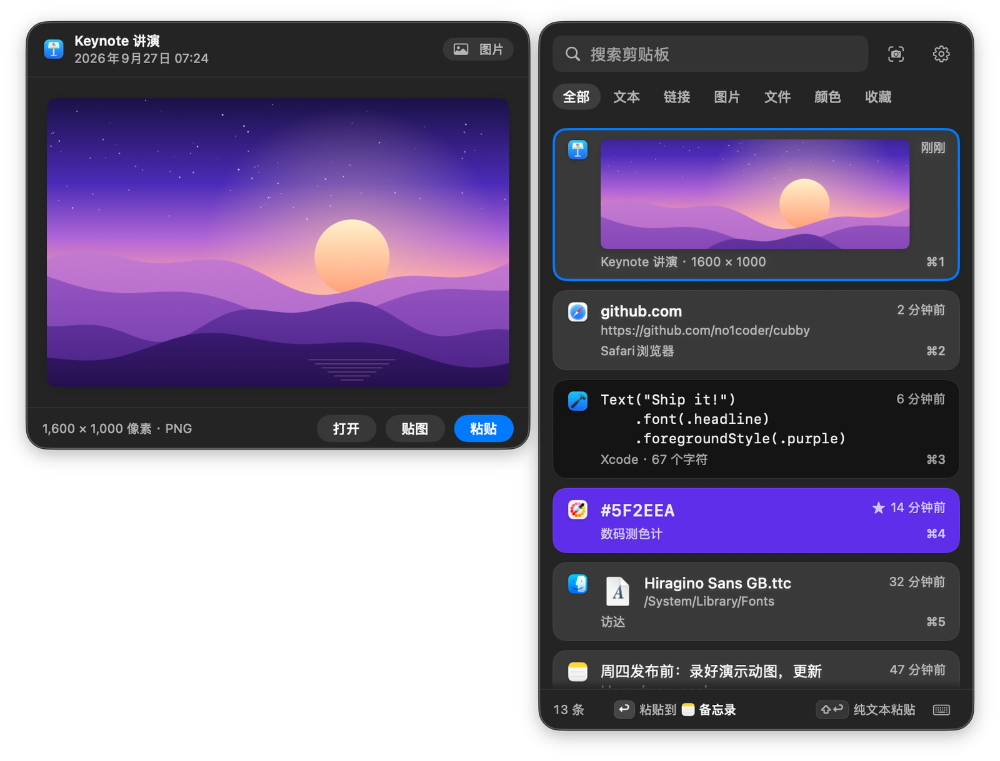
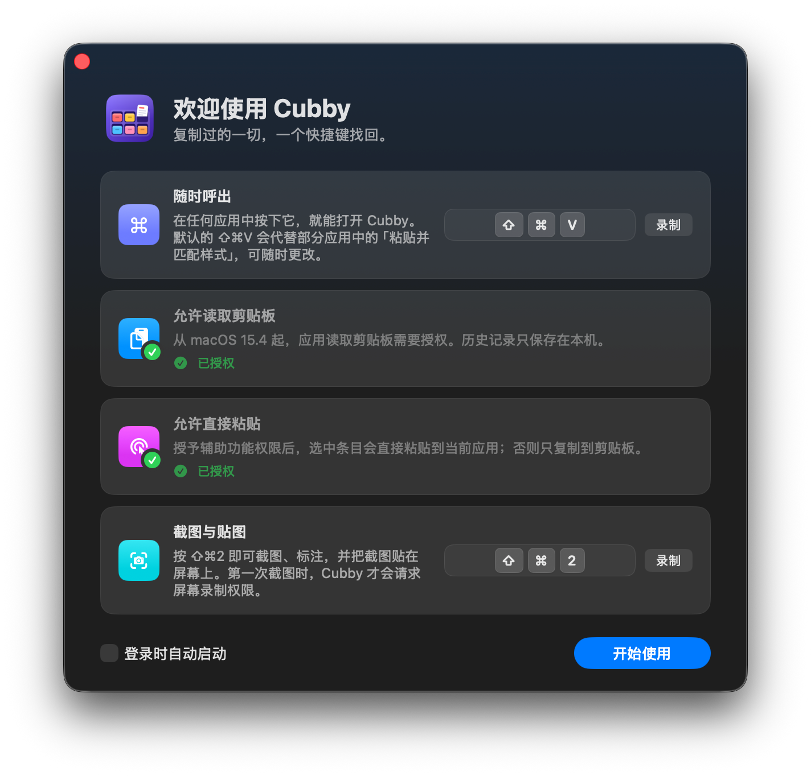
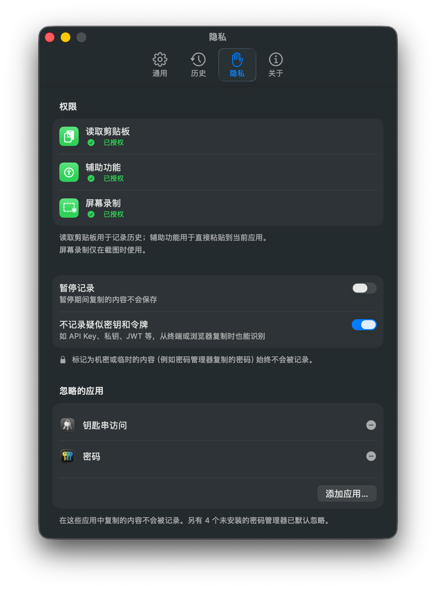
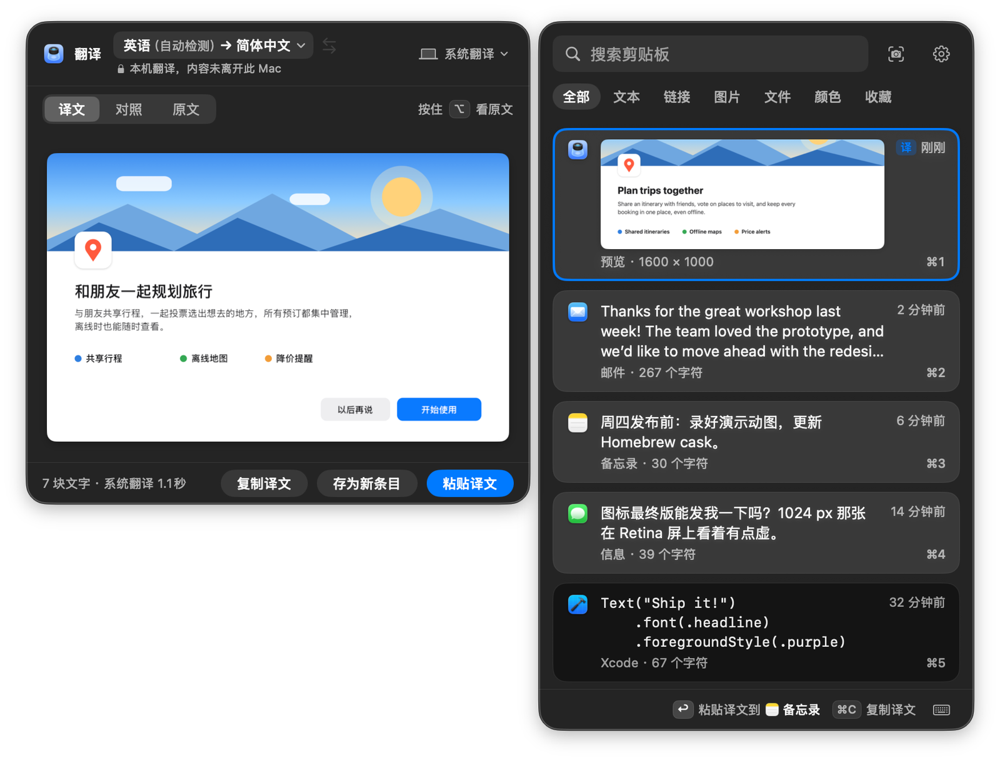
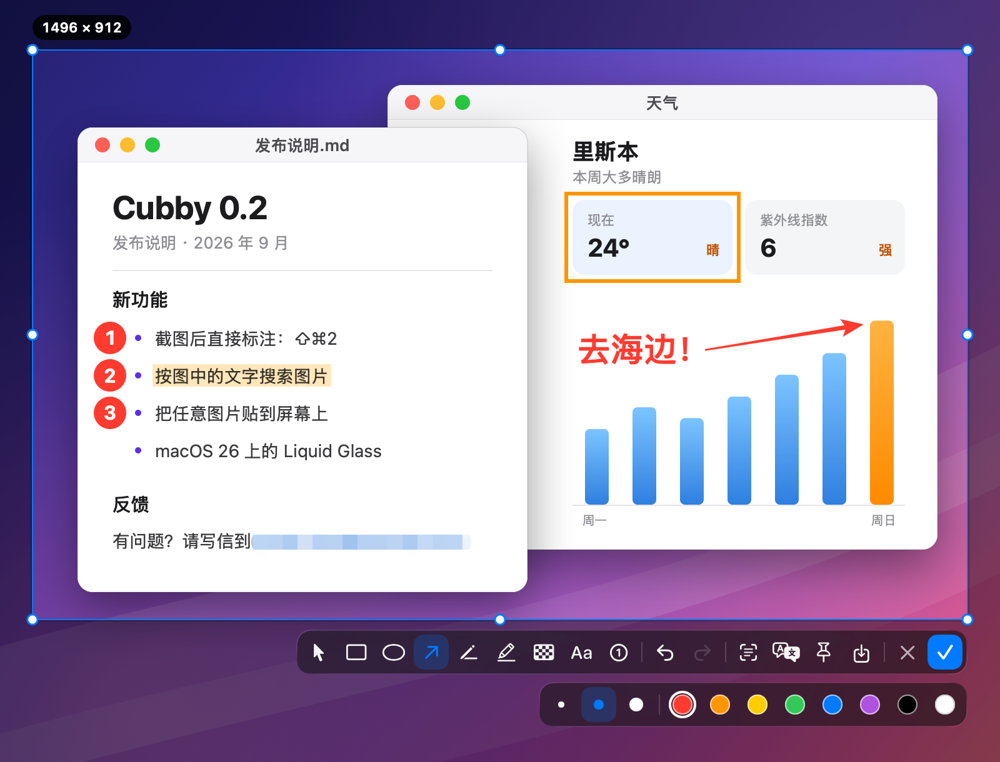

<p align="center">
  
</p>

<h1 align="center">Cubby · 小格子</h1>

<p align="center">
  原生、键盘优先、数据只留在本机的 macOS 剪贴板历史工具。
</p>

<p align="center">
  <a href="LICENSE"></a>
  
  
</p>

<p align="center">
  <a href="README.md">English</a> · <b>简体中文</b>
</p>

```sh
brew install --cask no1coder/tap/cubby
```

也可以从 [Releases](https://github.com/no1coder/cubby/releases/latest) 下载已公证的 DMG。需要 macOS 14 及以上，支持 Apple 芯片与 Intel。

<p align="center">
  <picture>
    <source media="(prefers-color-scheme: dark)" srcset="docs/assets/screenshots/panel-dark-zh.png">
    <source media="(prefers-color-scheme: light)" srcset="docs/assets/screenshots/panel-light-zh.png">
    
  </picture>
</p>

Cubby 常驻菜单栏，记住你复制过的文本、链接、颜色、图片和文件。按 <kbd>⇧⌘V</kbd> 呼出面板，输入几个字找到目标，按 <kbd>↩</kbd> 直接粘贴到正在使用的应用。按 <kbd>⇧⌘2</kbd> 截图并标注，截好的图也会进入历史，和你复制过的其他内容放在一起。只有在你检查更新、或用你自己配置的大模型翻译时，它才会联网。

## 功能

**记录**

- 记录文本、链接、HEX 颜色、图片和文件；富文本保留 RTF / HTML 格式。
- 再次复制相同内容时移到最前，不产生重复条目。
- 收藏永不过期；其余条目按你设定的上限保留（50 – 2000 条，默认 500）。

**查找**

- 全局快捷键（默认 <kbd>⇧⌘V</kbd>，可录制自定义组合）呼出卡片式面板，macOS 26 上为 Liquid Glass 效果。
- 卡片按内容呈现：颜色卡即颜色，代码为等宽字体，图片直接显示缩略图。
- 直接输入即可搜索，关键词高亮；多个关键词需全部命中，也能按文件路径和来源应用名搜索。结果按相关度排序，完整包含搜索词的条目排在最前。
- 可以按图中文字搜索图片（包括截图）。文字在本机识别，不会上传；可在「设置 › 历史」中关闭。
- 用 <kbd>⇥</kbd> 在文本、链接、图片、文件、颜色、收藏之间切换分类。
- <kbd>空格</kbd> 或 <kbd>⌘Y</kbd> 在侧边预览完整内容。
- 面板可出现在鼠标旁、菜单栏图标下方或屏幕中央。

**粘贴**

- <kbd>↩</kbd> 粘贴到刚才使用的应用，底栏会显示目标应用。
- <kbd>⇧↩</kbd> 以另一种格式粘贴（保留原格式 ↔ 纯文本），<kbd>⌘↩</kbd> 仅复制。
- <kbd>⌘1</kbd> – <kbd>⌘9</kbd> 快速粘贴前九条；卡片可直接拖到其他应用。
- <kbd>⌘⌫</kbd> 删除，<kbd>⌘Z</kbd> 撤销删除。
- macOS 26 上按 <kbd>⌘T</kbd> 在面板旁的翻译卡中翻译选中的条目，按 <kbd>⌥↩</kbd> 一步翻译并粘贴。详见 [剪贴板翻译](#剪贴板翻译)。

**截图**

- <kbd>⇧⌘2</kbd> 冻结屏幕画面，选窗口或拖出区域即可截图。截好的图复制到剪贴板，**同时存入剪贴板历史**，之后可以像其他复制内容一样搜到、再次粘贴。
- 悬停即自动识别窗口。窗口重叠时，用 <kbd>⇥</kbd> 或滚轮逐层切换，只露出一角的窗口也能一键选中。按 <kbd>空格</kbd> 进入纯净窗口截图：只截这一个窗口，不受遮挡，保留圆角与阴影。
- 标注工具：矩形、椭圆、箭头、画笔、荧光笔、马赛克、文字、序号。完成前标注始终可编辑：选中后可拖动、改色、删除。
- 可以把截图贴在屏幕上作为置顶小窗（贴图）、存为 PNG，或用本机 Vision OCR 提取文字，全程不联网。
- 历史中的任意图片也能用 <kbd>⇧⌘P</kbd> 以同样的方式贴到屏幕上。
- macOS 26 上按 <kbd>⇧⌘T</kbd> 可以原位翻译截图中的文字：默认使用 Apple 本机翻译，也可以接入兼容 OpenAI 接口的大模型，如 DeepSeek、通义千问、Kimi 或本机的 Ollama。详见 [截图翻译](#截图翻译)。
- 放大镜逐像素显示光标下的颜色，按 <kbd>C</kbd> 即可复制色值。

**隐私优先**

- 历史只保存在本机，并排除在 Time Machine 备份之外。
- 不记录密码管理器标记为机密 / 临时的内容和「忽略的应用」列表中的应用；默认也不记录疑似 API Key、私钥、JWT 的文本。
- 可随时从菜单栏暂停记录；恢复之前，面板顶部会一直显示提示横幅。
- 只在你要求时联网（检查更新，或使用你配置的大模型翻译），无统计，无遥测。详见 [隐私](#隐私)。

**原生**

- Swift 6 + SwiftUI / AppKit，零第三方依赖，Universal 二进制。
- 只在菜单栏，不占 Dock。界面支持英文与简体中文，默认跟随系统，也可以在「设置 › 通用」中单独选择。
- 支持 VoiceOver，并遵循「减弱动态效果」与「增强对比度」。

| 原位翻译截图 | 翻译剪贴板条目 |
| :---: | :---: |
|  |  |

<details>
<summary><b>更多截图</b></summary>
<br>

| 侧边预览 | 首次启动引导 | 隐私设置 |
| :---: | :---: | :---: |
|  |  |  |

</details>

## 安装

### Homebrew（推荐）

```sh
brew install --cask no1coder/tap/cubby
```

升级：`brew upgrade --cask cubby`。

### 下载安装包

1. 从 [最新 Release](https://github.com/no1coder/cubby/releases/latest) 下载 `Cubby-x.y.z.dmg`。
2. 打开后把 **Cubby** 拖进「应用程序」。
3. 从「应用程序」中启动（不要直接在磁盘映像或「下载」文件夹里运行）。

发布版使用 Developer ID 签名并经过 Apple 公证，首次打开只会出现一次确认。每个 Release 另附 `.zip` 与 `SHA256SUMS.txt`。

### 从源码构建

```sh
git clone https://github.com/no1coder/cubby.git
cd cubby
make install    # 构建 Universal Release 版，复制到 /Applications 并启动
```

需要 Xcode 26。签名方式见 [CONTRIBUTING.md](CONTRIBUTING.md)：使用默认的 ad-hoc 签名时，每次重新构建后 macOS 都会使辅助功能和屏幕录制授权失效。

## 使用说明

[使用说明](docs/USER-GUIDE.zh-Hans.md)按步骤介绍了每一项功能。在应用里，从菜单栏图标的菜单选择「使用说明…」即可打开（「设置 › 关于」和面板快捷键帮助的底部也有入口）。

## 首次启动与权限

首次启动会打开引导窗口：设置呼出面板的快捷键，授予两项权限（状态实时更新），并了解截图功能。之后可随时从菜单栏图标的右键菜单「设置向导…」重新打开。第三项权限「屏幕录制」只有截图才需要，所以引导窗口不会申请，而是在你第一次截图时才申请。

**macOS 15.4 及以上的剪贴板读取权限。** 在引导窗口（或「设置 › 隐私」）中点「去授权」，系统会当场弹出询问，选择「允许粘贴」。如果没有弹出，先随便复制一点内容再点一次。系统询问框没有「始终允许」选项，之后每次复制系统仍会询问，因此还需要在「系统设置 › 隐私与安全性 › 从其他 App 粘贴」（macOS 26 之前为「粘贴」）中将 Cubby 设为「允许」。系统询问过之后，按钮会变为「打开系统设置」，点击即可直达该页面。

| 权限 | 用途 | 开启位置 |
| --- | --- | --- |
| **剪贴板读取**（macOS 15.4 及以上） | 读取你复制的内容。未允许时系统会反复询问，或无法记录。 | 点「去授权」并在系统询问中选择「允许粘贴」，再到系统设置 › 隐私与安全性 › 从其他 App 粘贴（macOS 26 之前为「粘贴」）→ 将 Cubby 设为 **允许** |
| **辅助功能** | 向当前应用发送 <kbd>⌘V</kbd> 以直接粘贴。未授权时选中条目只会复制到剪贴板。 | 系统设置 › 隐私与安全性 › 辅助功能 → 打开 **Cubby** |
| **屏幕录制**（仅截图时需要） | 截图时捕捉屏幕画面。启动时和后台从不使用；未授权也不影响剪贴板历史。 | 系统设置 › 隐私与安全性 › 录屏与系统录音（macOS 14 为「屏幕录制」）→ 打开 **Cubby** |

开启屏幕录制后，macOS 可能要求退出并重新打开 Cubby，之后才能截图；Cubby 的屏幕录制引导窗口中的「退出并重新打开 Cubby」按钮可以一步完成。「设置 › 隐私」中可以查看全部三项权限的状态。

左键点击菜单栏图标打开面板；右键（或按住 Control 点按）打开菜单：截图、暂停记录、清空历史、设置、退出。

## 快捷键

| 按键 | 作用 |
| --- | --- |
| <kbd>⇧⌘V</kbd> | 打开 / 关闭面板（全局，可在「设置 › 通用」中修改） |
| 直接输入 | 搜索 |
| <kbd>↑</kbd> <kbd>↓</kbd> 或 <kbd>⌃P</kbd> <kbd>⌃N</kbd> | 选择 |
| <kbd>⌥↑</kbd> <kbd>⌥↓</kbd> 或 <kbd>Home</kbd> <kbd>End</kbd> | 跳到第一条 / 最后一条 |
| <kbd>Page Up</kbd> <kbd>Page Down</kbd> | 上移 / 下移 5 条 |
| <kbd>↩</kbd> 或双击 | 粘贴到当前应用 |
| <kbd>⇧↩</kbd> | 以另一种格式粘贴（保留原格式 ↔ 纯文本） |
| <kbd>⌘↩</kbd> | 仅复制，不粘贴 |
| <kbd>⌘1</kbd> – <kbd>⌘9</kbd> | 粘贴第 1 – 9 条 |
| <kbd>⌘T</kbd> | 翻译选中的条目（macOS 26）；再按一次关闭翻译卡 |
| <kbd>⌥↩</kbd> | 翻译并粘贴（macOS 26） |
| <kbd>空格</kbd> / <kbd>⌘Y</kbd> | 打开 / 关闭预览（<kbd>空格</kbd> 仅在搜索框为空时有效） |
| <kbd>⇥</kbd> / <kbd>⇧⇥</kbd> | 下一个 / 上一个分类 |
| <kbd>⌘P</kbd> | 收藏 / 取消收藏 |
| <kbd>⇧⌘P</kbd> | 把选中的图片贴到屏幕上 |
| <kbd>⌘⌫</kbd> | 删除 |
| <kbd>⌘Z</kbd> | 撤销删除 |
| <kbd>⌘O</kbd> | 打开链接或文件 |
| <kbd>⌘,</kbd> | 设置 |
| <kbd>esc</kbd> | 关闭帮助或预览 → 清空搜索 → 关闭面板 |

面板底栏右侧的键盘图标按钮可在应用内查看这份列表；右键点按卡片会列出可用操作及其快捷键。

## 剪贴板翻译

macOS 26 上，在面板中选中一条，按 <kbd>⌘T</kbd>（或 <kbd>⇧⌘T</kbd>）。翻译卡在面板旁打开，译文逐段出现。富文本保留标题、列表、粗体和链接，行内代码不翻译；图片与截图一样原位翻译。翻译卡打开期间会跟随选中项。在翻译卡中，<kbd>↩</kbd> 粘贴译文，<kbd>⇧↩</kbd> 以纯文本粘贴，<kbd>⌘C</kbd> 复制译文，<kbd>⌘S</kbd> 存为新条目。复制或粘贴译文不会加入历史。

<p align="center">
  
</p>

- <kbd>⌥↩</kbd> 一步完成：翻译选中的条目并粘贴译文。
- 在条目上按住 <kbd>⌥</kbd> 可在列表中预览译文，松开即恢复；按住期间按 <kbd>↩</kbd> 粘贴的就是所见的内容。
- 翻译卡的语言菜单可以为当前粘贴目标应用记住目标语言，例如粘贴到 Slack 时总是译为英语。「设置 › 翻译」中会列出这些应用。
- 译文随条目保存，再次打开立即显示，搜索也能按译文找到条目。在「设置 › 翻译 › 清除全部译文…」中可删除全部译文。
- 「复制外文时自动翻译」（设置 › 翻译，默认关闭）在你复制外文时，用本机的系统翻译自动翻译。只适用于已下载的语言，从不下载语言，也不联网。

剪贴板翻译使用你为截图选择的引擎（见 [截图翻译](#截图翻译)）。使用大模型时，只发送你所翻译条目的文字（图片则为其中识别出的文字）。疑似密钥的文字需要你确认后才会发送，图片中的疑似密钥从不发送。

## 截图

按 <kbd>⇧⌘2</kbd>、在菜单栏图标的右键菜单中选「截图」，或点面板上的相机按钮。屏幕画面随即冻结，光标下的窗口会高亮：单击选中该窗口，或拖拽框选区域。用手柄微调选区，用工具栏标注，然后按 <kbd>↩</kbd>。截图会复制到剪贴板并存入历史，前台应用保持不变，可以马上粘贴。

<p align="center">
  
</p>

| 按键 | 作用 |
| --- | --- |
| <kbd>⇧⌘2</kbd> | 截图（全局，可在「设置 › 截图」中修改） |
| 单击 / 拖拽 | 选中高亮的窗口或整屏 / 框选区域 |
| <kbd>⇥</kbd> / <kbd>⇧⇥</kbd> 或滚轮 | 在光标下重叠的窗口间逐层切换，最深一层为整屏 |
| <kbd>空格</kbd> | 纯净窗口截图模式：之后单击或按 <kbd>↩</kbd> 只截高亮的窗口，不受遮挡，带阴影（按住 <kbd>⌥</kbd> 单击则不带阴影）。再按 <kbd>空格</kbd> 退出 |
| 拖拽时按住 <kbd>⇧</kbd> / <kbd>⌥</kbd> / <kbd>空格</kbd> | 正方形选区 / 从中心扩展 / 平移选区 |
| <kbd>⌘A</kbd> | 选中整屏 |
| <kbd>↑</kbd> <kbd>↓</kbd> <kbd>←</kbd> <kbd>→</kbd> | 移动选区或选中的标注 1 pt（按住 <kbd>⇧</kbd> 为 10 pt） |
| <kbd>R</kbd> <kbd>O</kbd> <kbd>A</kbd> <kbd>P</kbd> <kbd>H</kbd> <kbd>M</kbd> <kbd>T</kbd> <kbd>N</kbd> | 矩形、椭圆、箭头、画笔、荧光笔、马赛克、文字、序号。再按同一个键或按 <kbd>V</kbd> 回到指针 |
| <kbd>⌫</kbd> | 删除选中的标注 |
| <kbd>⌘Z</kbd> / <kbd>⇧⌘Z</kbd> | 撤销 / 重做标注 |
| <kbd>C</kbd> | 复制放大镜下的颜色（按住 <kbd>⇧</kbd> 显示 RGB 而非 HEX） |
| <kbd>↩</kbd>、<kbd>⌘C</kbd> 或双击 | 完成：复制到剪贴板并存入历史 |
| <kbd>⌘S</kbd> | 存为 PNG：在存储对话框中选择文件夹和文件名；点取消会回到截图，标注都还在 |
| <kbd>⌘P</kbd> | 贴图（贴到屏幕上） |
| <kbd>⌘T</kbd> | 提取文字并复制 |
| <kbd>⇧⌘T</kbd> | 翻译选区中的文字（macOS 26）；翻译后在原文与译文之间切换 |
| 右键 | 清除选区后重新框选（标注保留）；没有选区时取消 |
| <kbd>esc</kbd> | 取消。画过标注后需按两次 <kbd>esc</kbd> 才会放弃截图 |

在文字框中输入时，<kbd>esc</kbd> 或 <kbd>⌘↩</kbd> 结束输入而不是取消截图，因此输入法照常可用。

贴图浮在所有窗口之上：拖动可移动，滚轮或双指捏合可缩放，<kbd>⌘0</kbd> 恢复原始大小，右键菜单可拷贝、存储或调整不透明度。双击或按 <kbd>esc</kbd> 关闭。历史中已有的图片也可以贴图：在面板中选中后按 <kbd>⇧⌘P</kbd>，或在卡片右键菜单、预览中选「贴图」，图片会出现在屏幕中央。

在「设置 › 截图」中可以修改或关闭截图快捷键，并设置截图存储位置；默认与系统截图相同，存在同一文件夹。存储对话框会打开上次使用的文件夹。关闭「每次存储前询问位置」后，<kbd>⌘S</kbd> 会直接存入这个文件夹，不再弹出对话框。暂停记录时仍可截图，只是不会存入历史。第一次截图时会申请屏幕录制权限（见 [首次启动与权限](#首次启动与权限)）。

### 截图翻译

macOS 26 上，点截图工具栏中的「翻译」或按 <kbd>⇧⌘T</kbd>。Cubby 识别选区中的文字，逐块翻译，并把译文画在原文所在的位置。按住 <kbd>空格</kbd> 可查看原文，也可以用卷帘对比。复制和存储使用「原文 | 译文」开关当前所选的版本。

<p align="center">
  
</p>

在「设置 › 翻译」中选择引擎：

- **系统翻译**（默认）：macOS 自带的翻译，在本机完成，可离线使用。首次翻译某种语言时，macOS 会询问是否下载语言包；Cubby 只负责弹出系统的下载界面，下载与否由你决定。
- **大模型**：任何兼容 OpenAI Chat Completions 接口的服务。预设：DeepSeek、通义千问（阿里云百炼，含中国内地与国际地址）、Kimi（月之暗面）、智谱 GLM（及国际版 Z.ai）、OpenAI、OpenRouter、本机 Ollama，也可以填写自定义地址。模型可以从列表中选择（「刷新」获取），也可以直接输入名称，然后点「测试连接」。在「翻译引擎」中选择「大模型」后才会显示这些设置；配置好后翻译就会使用大模型，随时可以切回系统翻译。

API Key 存在 macOS 登录钥匙串中，每个服务商一条，不会写入偏好设置、历史或日志，设置界面只显示最后四位。使用大模型翻译时，只把选区中识别出的文字发送到你选择的服务；图片不会上传，被马赛克遮住的文字、疑似密钥的文字不会发送。远程服务必须使用 HTTPS，只有 `localhost` 等本机地址可以用 HTTP。

## 隐私

- **只存本机。** 历史保存在 `~/Library/Application Support/Cubby`：目录权限 0700（仅本人可访问）、文件 0600，并排除在 Time Machine 之外。
- **跳过敏感内容。** 不记录标记为机密 / 临时的内容（密码管理器会这样标记）、「忽略的应用」列表中的应用（设置 › 隐私），以及（除非你关闭该选项）疑似 API Key、私钥、JWT 的文本。
- **粘贴不跑偏。** 发送 <kbd>⌘V</kbd> 前校验目标应用仍在前台。
- **截图只在本机。** 只有你主动截图时才会捕捉屏幕。框选和标注期间，画面只存在于内存中，取消截图不留任何痕迹。文字识别使用 Apple Vision 框架在本机完成。
- **图中文字只在本机。** 为了能按文字搜索图片，图片中的文字在本机识别，只保存在本地历史文件中。关闭「设置 › 历史 › 搜索图片中的文字」即删除全部识别结果。
- **默认不联网。** Cubby 只在你要求时联网：点击「检查更新」（或开启每周自动检查，默认关闭）时访问 `api.github.com/repos/no1coder/cubby/releases/latest`；使用大模型翻译截图时，把选区中识别出的文字（仅此而已）发送到你配置的服务；用它翻译剪贴板条目时，发送该条目的文字。系统翻译与复制时自动翻译都在本机完成。
- **无统计、无遥测、无崩溃上报。**

完整说明见 [PRIVACY.md](PRIVACY.md)。

## 常见问题

<details>
<summary><b>辅助功能开关显示已开启，但 Cubby 只复制不粘贴。</b></summary>

macOS 把该权限与应用的代码签名绑定。更新后，或安装了签名不同的版本（例如先装源码构建版、再装发布版），开关可能仍显示开启，实际已失效。打开「系统设置 › 隐私与安全性 › 辅助功能」，选中 **Cubby**，点 **−** 删除，再重新添加或重新打开 Cubby 授权。也可以在终端执行：

```sh
tccutil reset Accessibility io.github.no1coder.Cubby
```

然后打开 Cubby 重新授权。

</details>

<details>
<summary><b>macOS 提示无法打开 Cubby 或无法验证开发者。</b></summary>

正式发布版已经过公证，正常情况下只会出现一次「从互联网下载」的确认。请确认是从本仓库的 Releases 页面下载或通过 Homebrew 安装，并从「应用程序」中启动。可以这样检查签名：

```sh
spctl -a -vvv /Applications/Cubby.app    # 期望输出：source=Notarized Developer ID
```

若检查未通过，请删除后重新下载；问题仍在时欢迎 [提交 Issue](https://github.com/no1coder/cubby/issues/new/choose)。无需关闭 Gatekeeper。

</details>

<details>
<summary><b>数据存在哪里？</b></summary>

- 历史：`~/Library/Application Support/Cubby`（`history.json` 与 `Images` 文件夹）
- 偏好设置：`~/Library/Preferences/io.github.no1coder.Cubby.plist`
- 存储的截图：存储对话框中选择的位置；关闭「每次存储前询问位置」时为「设置 › 截图」中的文件夹（默认与系统截图相同）

「设置 › 历史」中可以在访达中显示数据目录。具体存储内容见 [PRIVACY.md](PRIVACY.md)。

</details>

<details>
<summary><b>能导出或备份历史吗？</b></summary>

暂不支持。导入导出计划在 v0.3 提供（见 [路线图](docs/ROADMAP.md)）。数据目录有意排除在 Time Machine 之外，因为剪贴板常含敏感内容。在此之前，可以先退出 Cubby，再手动复制 `~/Library/Application Support/Cubby`。请注意副本中包含你复制过的全部内容，且未加密。

</details>

<details>
<summary><b>如何卸载？</b></summary>

通过 Homebrew 安装的，以下命令会删除应用及全部数据：

```sh
brew uninstall --zap --cask cubby
```

其他情况请先退出 Cubby，然后执行：

```sh
rm -rf /Applications/Cubby.app ~/Library/Application\ Support/Cubby
defaults delete io.github.no1coder.Cubby
tccutil reset All io.github.no1coder.Cubby
```

</details>

## 参与贡献

欢迎提交问题、翻译与 Pull Request。源码构建、测试、代码风格与本地签名见 [CONTRIBUTING.md](CONTRIBUTING.md)（英文）。请阅读 [行为准则](CODE_OF_CONDUCT.md)；安全问题请按 [SECURITY.md](SECURITY.md) 私下报告。

## 路线图

见 [docs/ROADMAP.md](docs/ROADMAP.md)。v0.3 计划：按时间自动清理、多选合并粘贴、粘贴队列、文本转换、编辑后粘贴、Quick Look、导入导出。截图的后续改进包括：按住 <kbd>⌥</kbd> 识别界面元素、恢复上次选区。版本变化见 [CHANGELOG.md](CHANGELOG.md)。

## 许可证

[MIT](LICENSE) © 2026 no1coder
